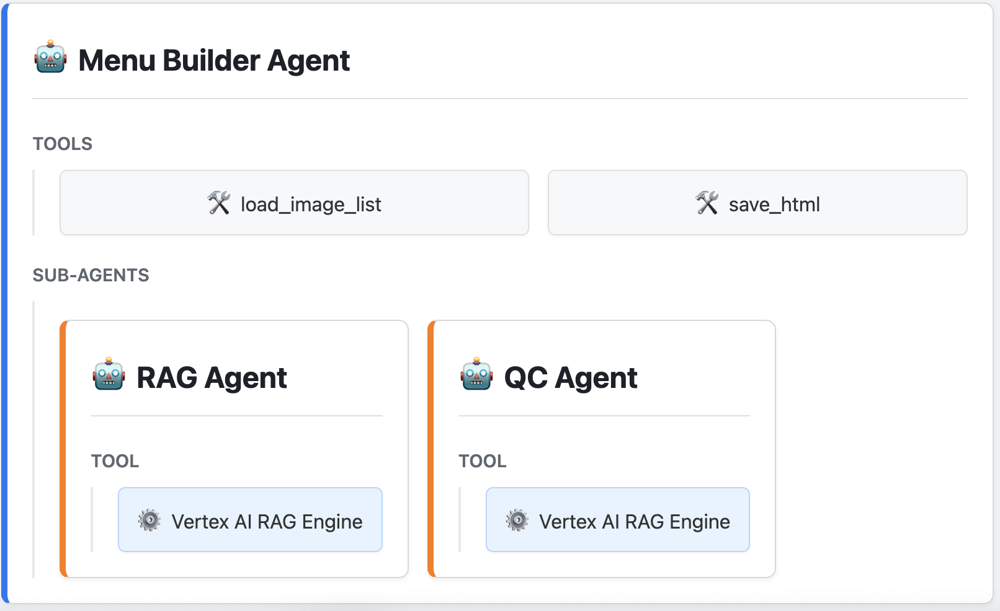

# AI Digital Menu Builder

This project contains a multi-agent application designed to automatically generate a dynamic, interactive digital menu from a source document. Built with the Agent Development Kit (ADK), it showcases an advanced workflow involving content extraction, multimodal AI analysis, quality control, and frontend code generation.

The system ingests a PDF containing a restaurant's menu strategy, extracts text and images, uses the Gemini model to analyze visual content, and constructs a self-contained HTML file with interactive features.

## Table of Contents
- [Architecture Overview](#architecture-overview)
- [Key Features](#key-features)
- [Getting Started: Prerequisites](#getting-started-prerequisites)
  - [1. Google Cloud Project Setup](#1-google-cloud-project-setup)
  - [2. Knowledge Source (Vertex AI RAG Engine)](#2-knowledge-source-vertex-ai-rag-engine)
- [Local Project Setup](#local-project-setup)
  - [Dependencies](#dependencies)
  - [Special Dependency: WeasyPrint](#special-dependency-weasyprint)
  - [Environment Variables](#environment-variables)
- [How to Run the Demo: A Step-by-Step Workflow](#how-to-run-the-demo-a-step-by-step-workflow)
  - [Step 1: Prepare Media and Source PDF](#step-1-prepare-media-and-source-pdf)
  - [Step 2: Run the Menu Builder Agent](#step-2-run-the-menu-builder-agent)
- [Inspecting the Output](#inspecting-the-output)

---

## Architecture Overview

This application uses a collaborative multi-agent system to orchestrate the menu creation process. The primary agents include a the Menu Builder Root Agent, a RAG Agent, and a Quality Control (QC) agent that facilitates a self-correction loop.



---
## Key Features

* **Automated Content Extraction Pipeline:** Intelligently parses a source PDF to extract menu items, descriptions, prices, and images. 
* **Dynamic Frontend Generation:** Constructs a single, self-contained HTML file with embedded CSS and JavaScript for a rich user experience. 
* **Built-in Quality Control:** An automated QC agent reviews the generated HTML for errors and provides actionable feedback to the builder agent for self-correction.
* **Interactive UI:** The final HTML output includes features like directly editable text fields, text-to-speech buttons, save/export functionality, and a user feedback loop.

---
## Getting Started: Prerequisites

### 1. Google Cloud Project Setup
You need a Google Cloud account and a project with billing enabled to use the Gemini model for image analysis.
- **Get Started:** [Create a Google Cloud Project](https://cloud.google.com/resource-manager/docs/creating-managing-projects)
- **Enable APIs:** Ensure the **Vertex AI API** is enabled for your project.
- **Authenticate:** Authenticate your local environment using the gcloud CLI.
  ```bash
  gcloud auth application-default login
  ```

### 2. Knowledge Source (Vertex AI RAG Engine)
The retriever agent within the system uses the RAG Engine to access the source document.
- **Get Started:** [Vertex AI RAG Overview](https://cloud.google.com/vertex-ai/generative-ai/docs/rag-overview)
- **Action:** Create a RAG Corpus and upload the final, generated `restaurant_proposal.pdf` (created in the workflow below) to ground the retriever agent. Note the full resource name of your corpus for the `.env` file.

---
## Local Project Setup

### Dependencies
* Python 3.10+
* [Poetry](https://python-poetry.org/docs/) for dependency management.
* [Git](https://git-scm.com/)

1.  **Clone the Repository:**
    ```bash
    git clone <your-repo-url>
    cd <your-repo-name>
    ```
2.  **Install Python Dependencies:**
    This command reads the `pyproject.toml` file and installs dependencies into a virtual environment.
    ```bash
    poetry install
    ```
3.  **Activate the Virtual Environment:**
    ```bash
    poetry shell
    ```

### Special Dependency: WeasyPrint
When using the optional preprocessing scripts, this project requires `WeasyPrint`  to generate the source PDF. Installation can have system-level dependencies.
- **Instructions:** Follow the detailed guide at [https://weasyprint.org/install/](https://weasyprint.org/install/).
- **For macOS with Homebrew:**
  ```bash
  brew install weasyprint
  ```

### Environment Variables
Rename `.env.example` to `.env` in the project root directory and populate it with your GCP project details.

```ini
# Vertex backend config
# Rag Engine only works with Vertex. So we should configure it to use Vertex:
GOOGLE_CLOUD_PROJECT='YOUR_GOOGLE_CLOUD_PROJECT_ID'
GOOGLE_CLOUD_LOCATION='us-central1'

# Existing corpus in Vertex RAG Engine to be used by RAG agent
# e.g. projects/123/locations/us-central1/ragCorpora/456
RAG_CORPUS='projects/YOUR_GOOGLE_CLOUD_PROJECT_ID/locations/us-central1/ragCorpora/YOUR_RAG_CORPUS_ID'

```

---
## How to Run the Demo: A Step-by-Step Workflow

This demo involves a two-stage process: first, preparing the source media and PDF, and second, running the main agent to build the menu.
Note: you can skip the first step if you use the images and documents provided in this example. 

### Step 0: Prepare Media and Source PDF [Optional]
These scripts use `weasyprint` and other libraries to generate AI images for the menu and compile them into the final source PDF that the main agent will use as input.

Because `weasyprint` relies on system libraries outside the Python virtual environment, you must run these commands exactly as shown below on macOS.

**A. Generate AI Images for the Menu:**
```bash
DYLD_FALLBACK_LIBRARY_PATH=$(brew --prefix)/lib poetry run python menu_builder/resources/_generate_media_pdf.py
```

**B. Ingest Media and Create the Final PDF:**
```bash
DYLD_FALLBACK_LIBRARY_PATH=$(brew --prefix)/lib poetry run python menu_builder/resources/_ingest_media.py
```
After these scripts complete, you will have a `restaurant_proposal.pdf` in your `resources` folder.

### Step 1: Run the Menu Builder Agent
With the source PDF prepared, you can now run the main agent using the ADK Web UI.
From the project root directory, run:
```bash
poetry run adk web
```
This will start a local web server. Open the provided URL in your browser and select the `menu_builder` agent from the dropdown to start the process.

---
## Inspecting the Output

After the agent finishes its run, it will save the final, interactive HTML file to the `output/` directory (e.g., `output/menu.html`).

Simply open this file in a web browser to see the generated digital menu and test its features:
- Click the "✏️" icon to edit text directly.
- Click the "🔊" icon to hear the text read aloud.
- Click the "Save Changes" button to download a new version with your edits.
- Click the "Export Final" button to download a clean version without the editing controls.

## HITL 

You can make changes on the text components directly in the provided html. For an interactive building experience, feel free to converse with the menu builder agent and let it know in the chat interface if you want to see any changes on the digital menu. 